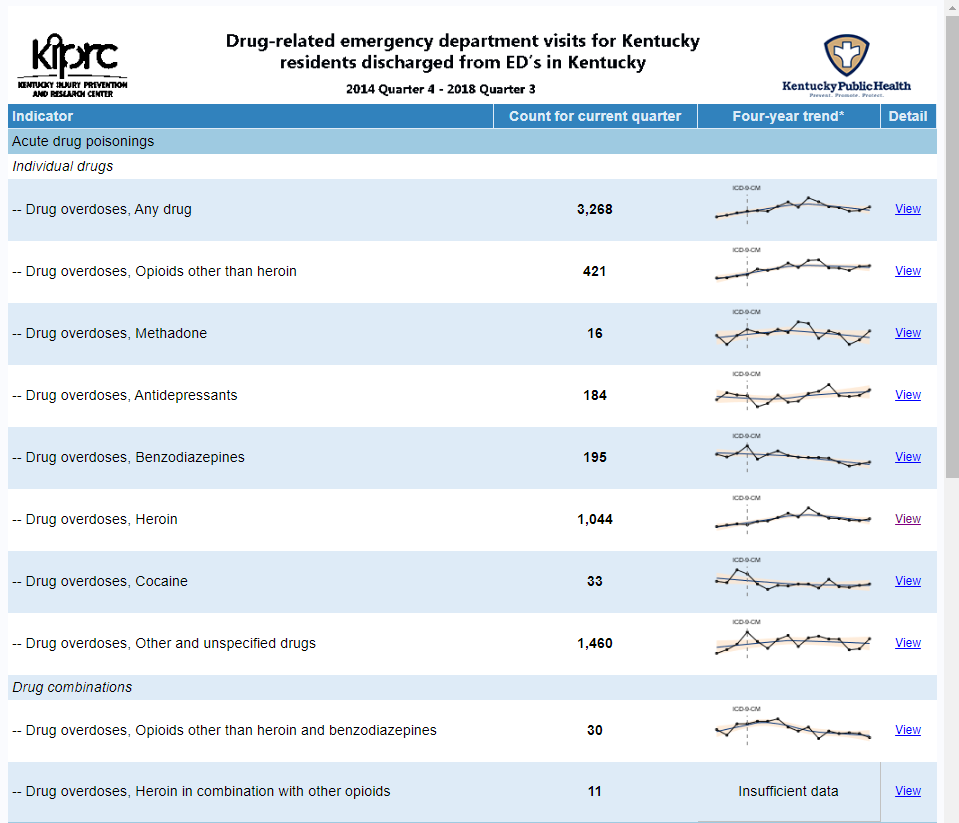

# od-dash
Drug overdose public health dashboard
A public health dashboard for monitoring emergency department visits and hospital discharges related to drug overdose. Developed using SAS 9.4, and utilizing functionaity provide by the SAS ODS Report Writing Interface.

